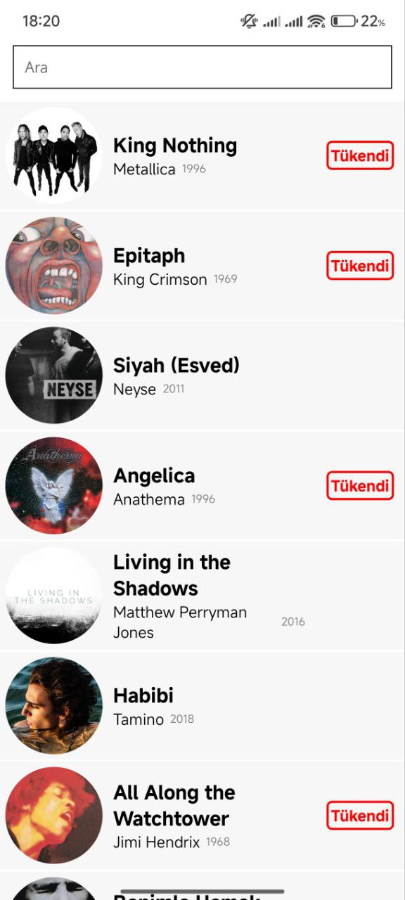
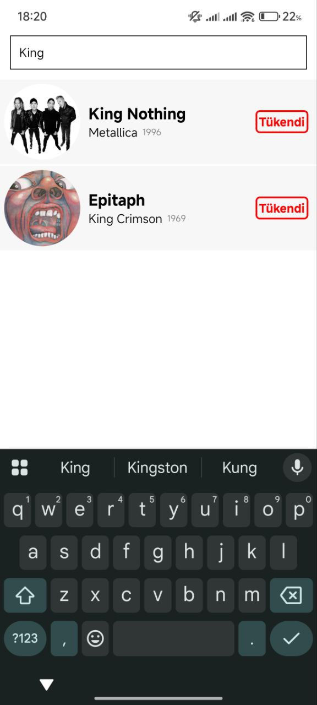
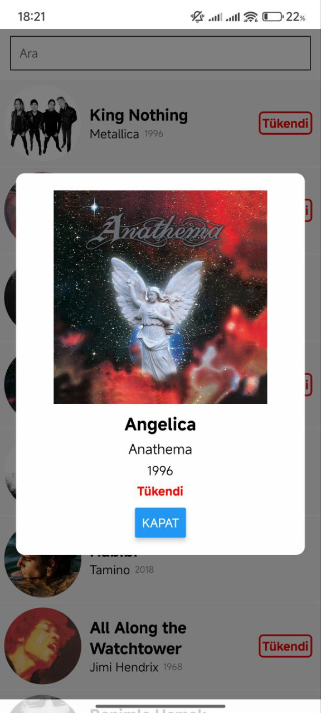

Onur, sana örnek olarak README dosyanı, proje ekran görüntüleriyle ve React Native/Expo notlarıyla düzenledim. Bu haliyle, GitHub üzerinde proje tanıtımı için uygun:

````markdown
# My Music App 🎵

Bu, Expo ile geliştirilmiş bir React Native müzik uygulamasıdır. Kullanıcılar şarkıları görebilir, arayabilir ve detaylarına bakabilir.

---

## Proje Ekran Görüntüleri

### Ana Ekran


### Arama


### Şarkı Detay


---

## Başlamak

1. Bağımlılıkları yükle

```bash
npm install
````

2. Uygulamayı başlat

```bash
npx expo start
```

Ardından uygulamayı şu şekilde açabilirsin:

* [Android Emulator](https://docs.expo.dev/workflow/android-studio-emulator/)
* [iOS Simulator](https://docs.expo.dev/workflow/ios-simulator/)
* [Expo Go](https://expo.dev/go)

---

## Dosya Yapısı

* **app/** → Uygulama sayfaları
* **assets/** → Görseller ve diğer medya dosyaları
* **package.json** → Proje bağımlılıkları

---

## Sıfırdan Başlamak

```bash
npm run reset-project
```

Bu komut, starter kodunu `app-example` dizinine taşır ve temiz bir `app` dizini oluşturur.

---

## Kaynaklar

* [Expo Docs](https://docs.expo.dev/)
* [React Native Docs](https://reactnative.dev/docs/getting-started)

---

## Katıl

* [Expo GitHub](https://github.com/expo/expo)
* [Expo Discord](https://chat.expo.dev)
